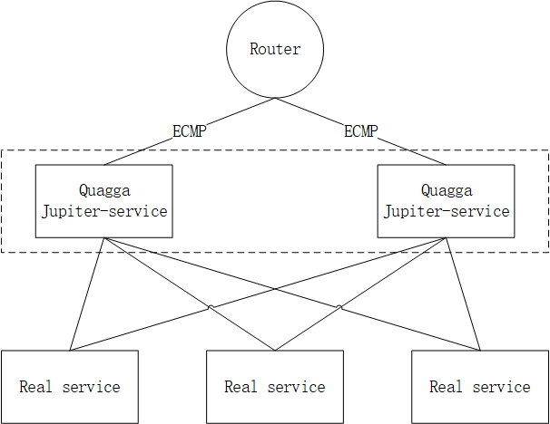

[Chinese](README.zh_cn.md)

# Jupiter

## Introduction

Jupiter is a high-performance 4-layer network load balance service based on DPDK. It supports TCP and UDP packet forwarding in FULLNAT mode. The load balancing algorithms supported by jupiter include [consistent hashing](https://www.codeproject.com/Articles/56138/Consistent-hashing), rr, lc.

* Support TCP, UDP protocol
* Support session maintenance for application
* Support load balance service scale out
* Support million QPS for visitors
* Support query limit for visitors

## How to use

### 1. Compilation

Required  OS release: Centos-7.2 or Centos-7.4

```bash
tar -xf jupiter.tar.gz
cd jupiter
make rpm-pkg
rpm -i rpmbuild/RPMS/x86_64/jupiter-0.1-1.x86_64.rpm
```

### 2. Startup

The default configuration path for jupiter-service is /etc/jupiter/jupiter.cfg. An example for jupiter.cfg as follows :

EAL configuration reference [DPDK document](http://dpdk.org/doc/guides/testpmd_app_ug/run_app.html#eal-command-line-options).

```vim
[EAL]
cores = 1-3
memory = 4096,0
mem-channels = 4

[NETDEV]
name-prefix = jupiter
ip-local-address = 10.0.2.1, 10.0.2.2
kni-ipv4 = 1.1.1.2
kni-netmask = 255.255.255.0
kni-gateway = 1.1.1.254
```

Reserve huge pages memory:

```bash
mkdir -p /mnt/huge
mount -t hugetlbfs nodev /mnt/huge
echo 4096 > /sys/kernel/mm/hugepages/hugepages-2048kB/nr_hugepages
```

Load [igb_uio](http://dpdk.org/doc/guides/linux_gsg/linux_drivers.html) module:

```bash
modprobe uio
insmod /usr/share/jupiter/kmod/igb_uio.ko
/usr/share/jupiter/tools/dpdk-devbind.py --bind=igb_uio eth1
```

Load [rte_kni](http://dpdk.org/doc/guides/linux_gsg/enable_func.html#loading-the-dpdk-kni-kernel-module) module:

```bash
insmod /usr/share/jupiter/kmod/rte_kni.ko
```

Start up jupier-service:

```bash
jupiter-service --daemon
```

## Simple Test

### 1. Test network diagram


### 2. ab-client configuration

```bash
ifconfig eth0 1.1.1.1/24 up
route add -net 10.0.1.0 netmask 255.255.255.0 gw 1.1.1.2
```

### 3. nginx-server configuration

```bash
ifconfig eth0 1.1.1.3/24 up
route add -net 10.0.2.0 netmask 255.255.255.0 gw 1.1.1.2
```

### 4. jupiter-service configuration

Add a TCP virtual service 10.0.1.1:8888 and two nginx service 1.1.1.3:80, 1.1.1.4:80.

```bash
ifconfig jupiter0 1.1.1.2/24 up
jupiter-ctl vs/add 10.0.1.1:8888 tcp
jupiter-ctl rs/add 10.0.1.1:8888 tcp 1.1.1.3:80
jupiter-ctl rs/add 10.0.1.1:8888 tcp 1.1.1.4:80
```

### 5. ab-client request VIP service

```bash
ab http://10.0.1.1:8888/
```

## Scale out



## Performance

CPU model: Intel(R) Xeon(R) CPU E5-2698 v4 @ 2.20GHz

NIC model: Intel Corporation 82599ES 10-Gigabit SFI/SFP+ Network Connection

Jmeter version: apache-jmeter-3.1

Nginx version: nginx-1.10.2

Bind version: bind-9.9.4

Jupiter-service configuration: 8 lcore and 4G memory

|protocol|schedule|TPS|ERROR|jupiter rx-pps|jupiter rx-bps|
|-|-|-|-|-|-|
|TCP|ipport|2064789.7|0|4.78M|8.41G|
|TCP|rr|2060283.5|0|4.78M|8.41G|
|TCP|lc|777078.5|0|-|-|
|UDP|ipport|4212952|0|8.28M|7.75G|
|UDP|rr|4272837.6|0|8.28M|7.75G|
|UDP|lc|812356.2|0|-|-|
